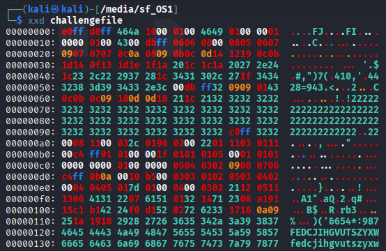
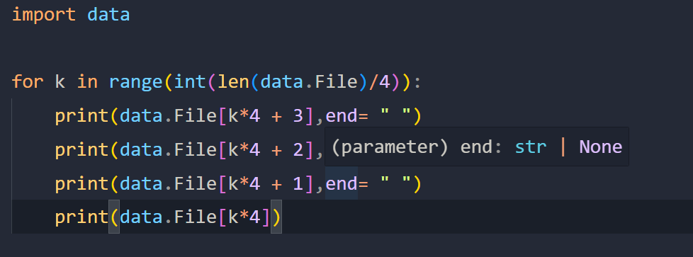

# ENDIANNESS_V2_PICOCTF

## Mission:


## Solution:

### 1. Exploration:

- Firstly, I use xxd command to look inside of the file:
    ```bash
    xxd challangefile
    ```

    

- Very obviously, it is a jpeg file, but it look kinda weird. Blocks of 4 bytes are being reverse. 
- After researching for a while, I know that this is little-endian byte order type.
- So now we know what is it, so how can we reverse from little-endian to big-endian?

- I found 2 ways, the first one I have finded on the internet that you cound use hexdump command to reverse all bytes.

    ```bash
    hexdump -v -e '1/4 "%08x"' -e '"\n"' challangefile | xxd -r -p > image.jpg
    ```

- The second way is if you dont know or forgot how to write the command is to use python.

    - First, I save a hex dump file into a list:

    

    - Then I create a python file that can help me reverse blocks of 4 bites one by one.

    .

    - After run it and save it and use xxd to reverse it into a image. We will see the flag.

    ```bash
    python convert.py | xxd -r -p > image.jpg
    ```