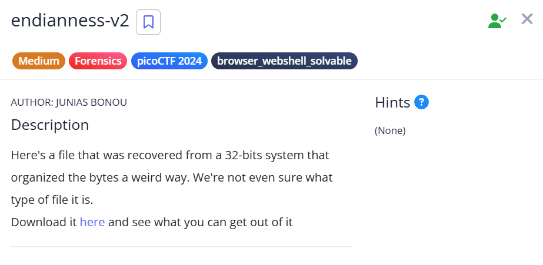
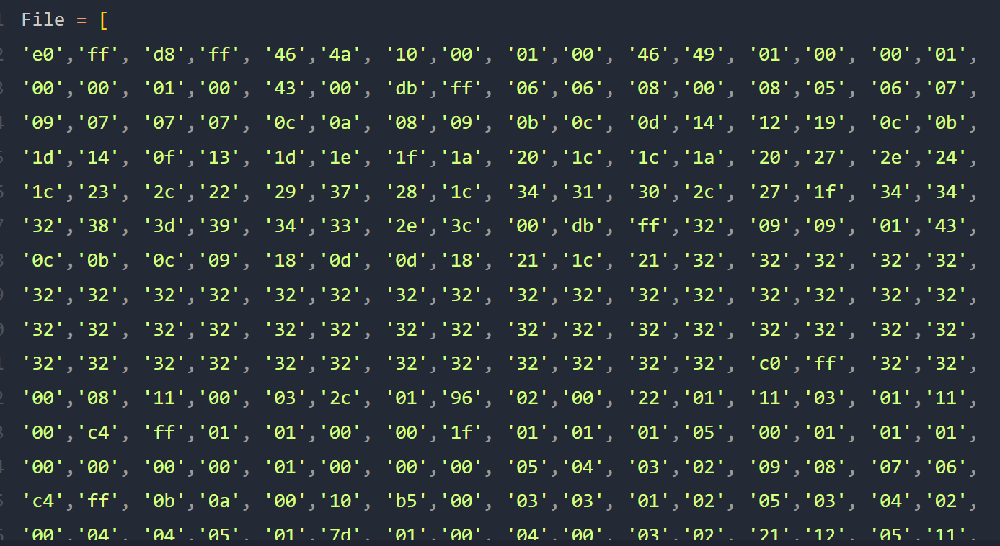

# 🧩 ENDIANNESS_V2_PICOCTF

## 🎯 Mission


---

## 🛠️ Solution

### 🔍 1. Exploration

- First, I used the `xxd` command to inspect the file:

    ```bash
    xxd challangefile
    ```

    

- It is very obvious that the file is a **JPEG**, but it looks strange —  
  **blocks of 4 bytes are reversed**.
- After researching for a while, I realized this is due to **little-endian byte order**.
- Now that we understand the issue, the next question is:  
  **How can we reverse it back from little-endian to big-endian?**

---

### 🔄 2. Method 1 — Using `hexdump`

- I found a method online using the `hexdump` command to reverse every 4-byte block:

    ```bash
    hexdump -v -e '1/4 "%08x"' -e '"\n"' challangefile | xxd -r -p > image.jpg
    ```

---

### 🐍 3. Method 2 — Using Python

- If you don’t know or forget the `hexdump` syntax, you can also use Python.

    #### 📄 Step 1 — Save the hex dump into a list


    


    #### 📄 Step 2 — Create a Python script to reverse each 4-byte block

    

    #### ▶️ Step 3 — Run the script and convert it back into an image

    ```bash
    python convert.py | xxd -r -p > image.jpg
    ```

- After running this, the image is restored — and you will see the **flag**.

---