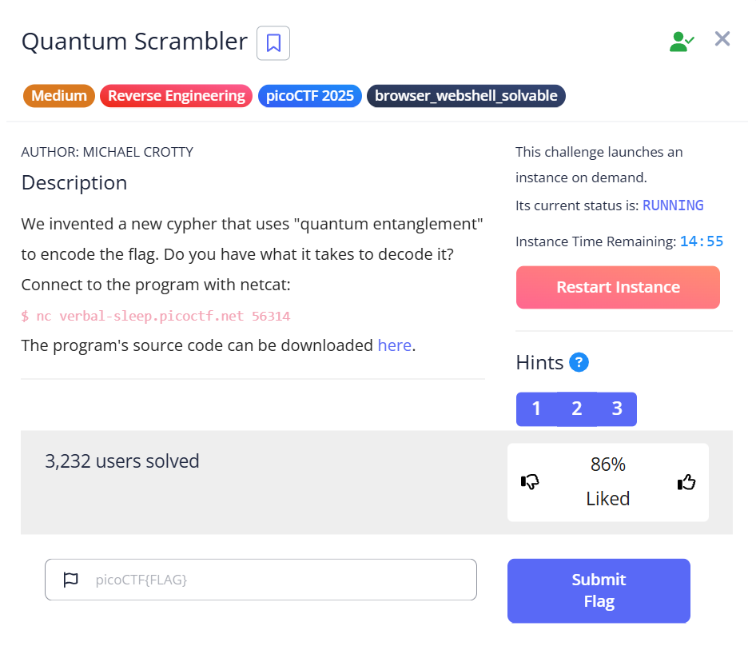
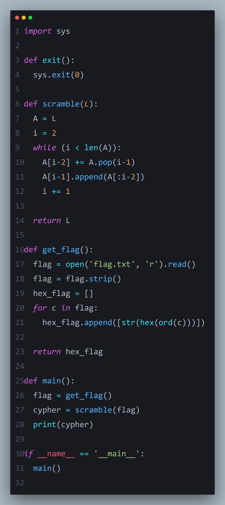
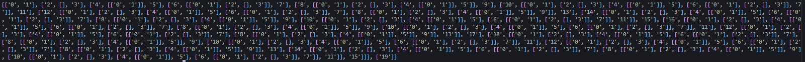

# 🔍 Scrambling and Retrieving the Flag
   
In this challenge, the main task revolves around a **scrambling function** applied to the flag. The process can be summarized as follows:

1. The code takes the **flag**.
2. Converts it into **hexadecimal**.
3. Applies a **scrambling function** to the hex representation.

The key to solving this challenge lies in understanding the **scramble function**.

---

### 🧩 Understanding the Scramble Function

After analyzing the code, I realized that the scramble function primarily operates on a list of characters, for example:
['1','2','3', ...]

To verify this, I wrote a small function that only scrambles this numeric list. The output confirmed my hypothesis:

  

💡 Observation: The output pattern of the scramble function depends only on the **first and last elements of the list**.

---

### 🛠️ Exploiting the Pattern

Knowing that only the **first and last hex values** determine the scrambled result, I developed a solution:

1. Take the **first and last hex codes** from the scrambled list.
2. Convert them back using **hexadecimal decoding**.
3. Retrieve the original flag.

Essentially, this allows us to **bypass the complex scramble function** and directly obtain the flag.

---

### 🎯 Conclusion

By carefully analyzing the behavior of the scramble function and testing it with a simple numeric list, the challenge became trivial. The solution highlights an important point in CTF challenges:

> Sometimes, the apparent complexity hides a simple underlying pattern.

---

