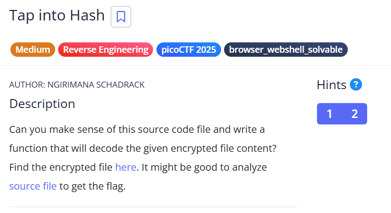
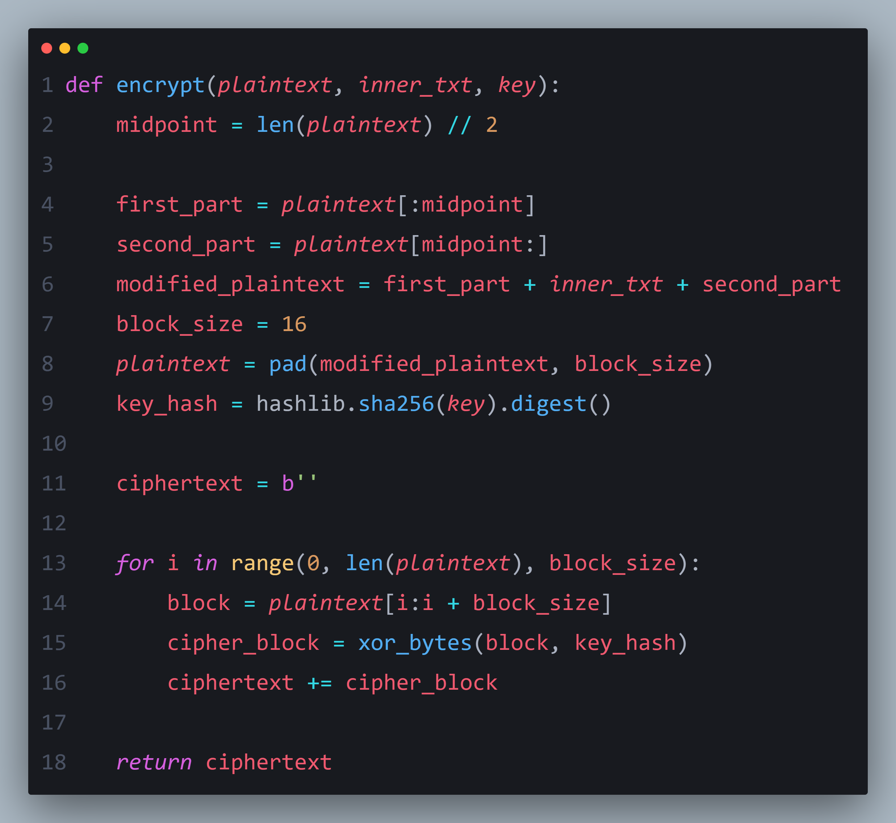
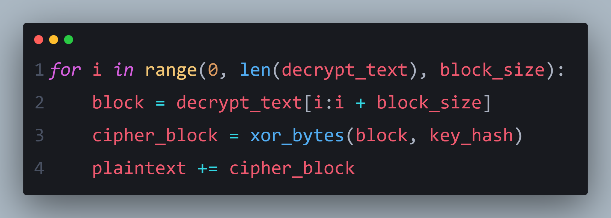

# 🔑 Reverse Engineering: Decrypting the Flag

  

In this challenge, the binary contains an **encryption function** that hides the flag inside a variable called `inner_txt`.

---

### 🔍 Observing the Code

Looking at the code, we notice the **encrypt function**:

  

💡 Key observation: the flag is stored in `inner_txt` and is processed by this function.

---

### 🛠️ Building a Decryption Script

To retrieve the flag, we can **write a small script** to reverse the encryption logic:

  

By applying this approach, we can **successfully decrypt** the hidden flag.

---

### 🎉 Result

After running our decryption script, we finally get the flag.  

> ✅ Note: Understanding how the encrypt function manipulates the data was the key. Once the logic is clear, building the decryption code becomes straightforward.
