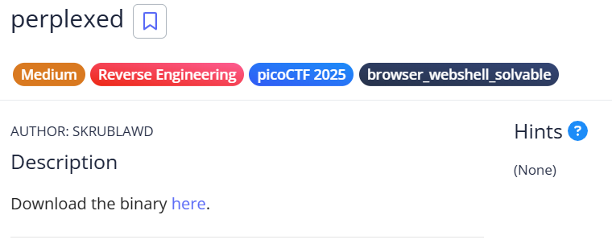
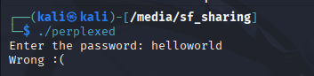
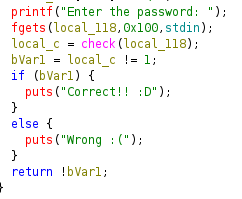
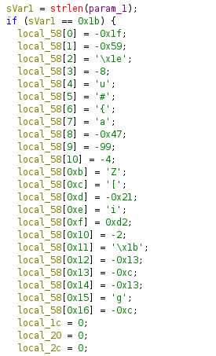
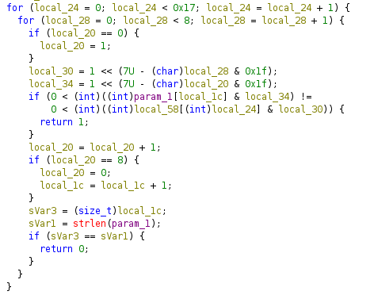

# 🧩 Reverse Engineering — Solving the ELF Challenge

This challenge provides us with an **ELF binary**.  
Before diving into reverse engineering, I tried running the file to observe its behavior:

As expected, it asks for an input and validates it internally.  
So the next step is to analyze the binary using **Ghidra**.

---

## 🛠️ Analyzing the Binary in Ghidra

Opening the file in Ghidra:

Inside, we locate the function responsible for validating the input — the **check()** function.

---

## 🔍 Inspecting the `check()` Function

<table>
<td>

</td>

<td>

</td>
</table>

From the disassembly, we can see that the program:

- Iterates through each character of the input  
- Applies a transformation / comparison  
- Validates whether each character matches the expected pattern  

So the logic essentially checks every character individually using a predictable transformation.

---

## 🧪 Rebuilding the Check Function

To recover the flag, we can simply **reimplement the check logic** in Python and brute‑force the correct characters.

Once implemented, each character is tested until it matches the expected output pattern.

---

## 🎉 Final Result

After recreating the logic and brute‑forcing each character:

> ✔️ **We successfully retrieve the flag.**

Voilà — puzzle solved!