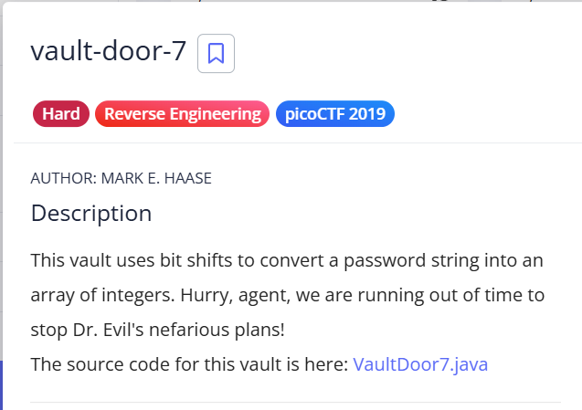
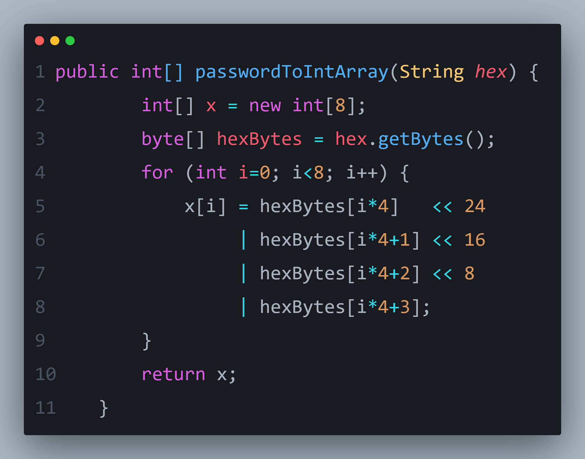
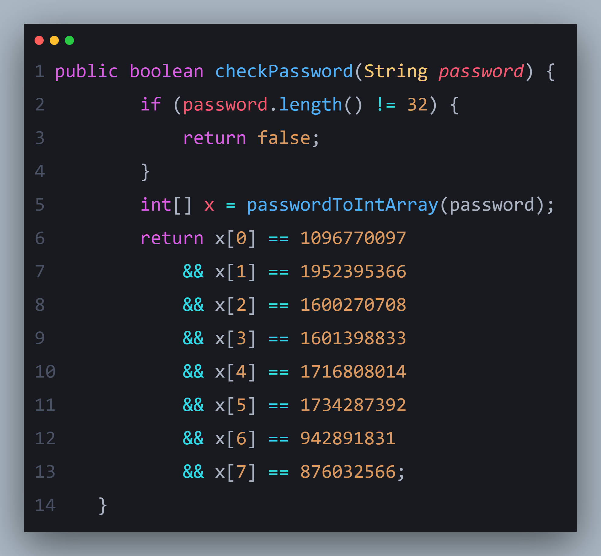
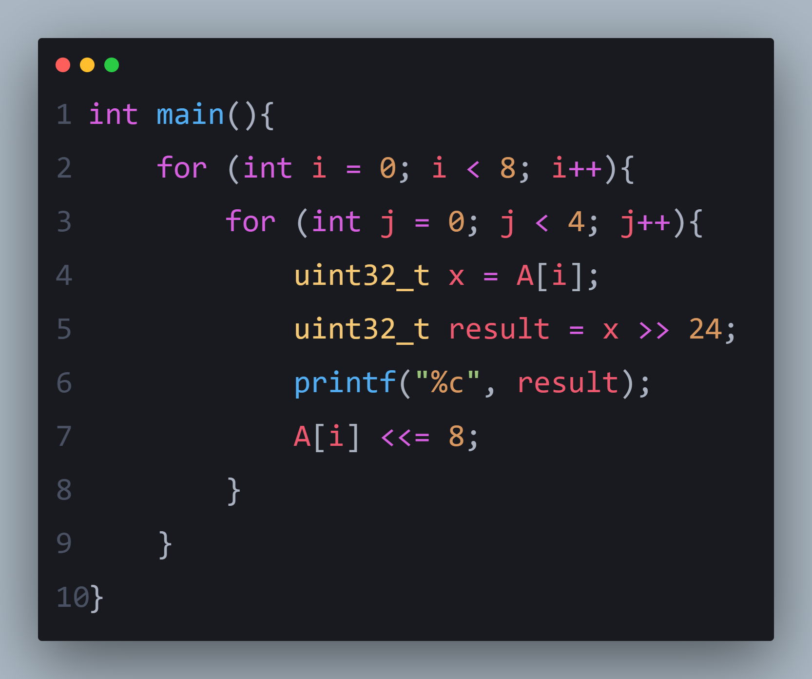
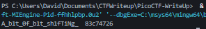

# 🔐 VAULT-DOOR-7-SOLUTION

At first glance, the code reveals two important functions:  
**`checkPassword()`** and **`passwordToIntArray()`**.  
These two functions work together to transform the input and verify whether it matches the expected encoded password.

---

## 🧩 Inspecting the Core Logic

<table>
<td>

</td>
<td>

</td>
</table>

The `passwordToIntArray()` function converts the input string into bytes, and then **groups them four at a time, adding the values together**.  
This means each 4-byte block is summed into a single integer.  

💡 **Key insight:**  
If we reverse this grouping, we can extract each original byte and reconstruct the flag.

---

## 🛠️ Recreating the Logic

To undo this encoding, I wrote a small helper function to split the bytes and rebuild the original password:

Running the script gives us the decoded output.

---

## 🎉 Final Result

And voilà — the flag is revealed!

